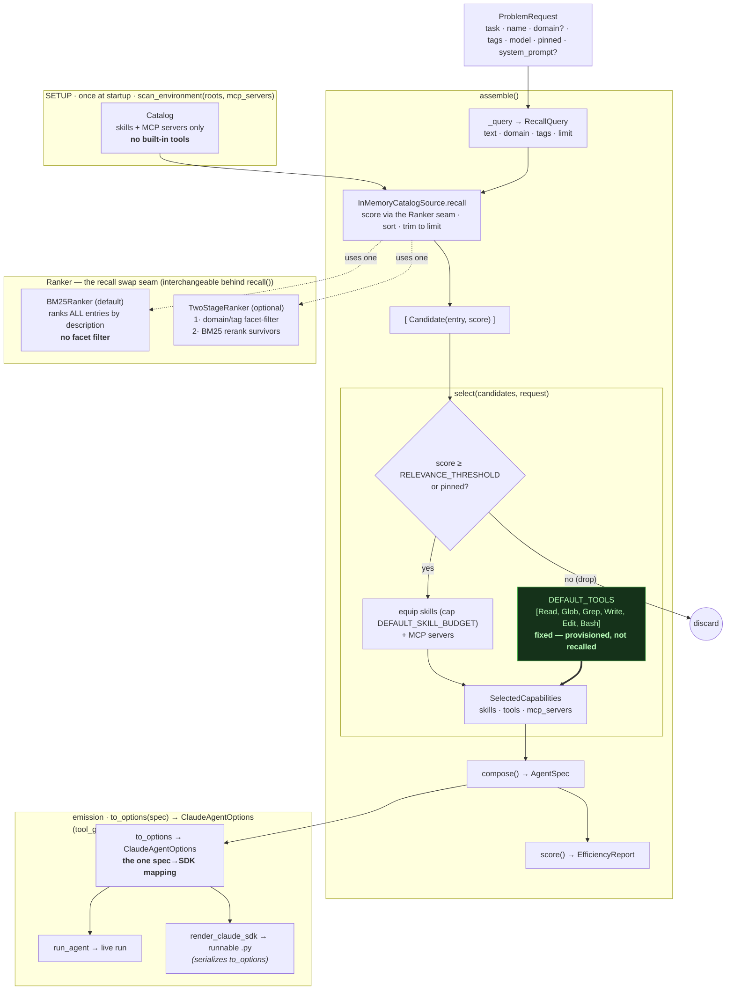

# Generation pipeline

The deterministic path from a `ProblemRequest` to an emitted agent. Skills and MCP servers are
retrieved by lexical recall; built-in tools are provisioned as a fixed set (their descriptions are
mechanical and never match a task's goal language, so recall can't surface them).

Entry points: [src/agent_fleet/main.py](../src/agent-fleet/src/agent_fleet/main.py) (CLI) and
[src/agent_fleet_api/routes.py](../src/agent-fleet-api/src/agent_fleet_api/routes.py) (HTTP).

The thick edge (`PROV ==> SELC`) is the tool lane: tools enter selection as a fixed set, bypassing
recall, so a generated agent is never emitted with zero tools.

`recall()` scores through a pluggable `Ranker` (the swap seam). The default `BM25Ranker` ranks
**every** entry by description — no facet filter. `TwoStageRanker` instead narrows first (a `domain`
query cuts only entries declaring a *different* domain; a tags-only query keeps the top-K by
IDF-weighted tag overlap, untagged entries passing through), then reranks the survivors by
description. Same `recall()` contract either way — only the default differs from the two-stage path.
`select()` then threshold-filters whatever the ranker returned: an entry is dropped unless it clears
`RELEVANCE_THRESHOLD` **or** is pinned.

## Stage reference

| Stage | Code | In → Out |
| --- | --- | --- |
| Scan | `capabilities_discovery.discovery.scan_environment` ([separate repo](https://github.com/Magic-Man-us/capabilities-discovery)) | roots, mcp_servers → `Catalog` (skills + MCP servers) |
| Query | [engine/pipeline.py](../src/agent-fleet/src/agent_fleet/engine/pipeline.py) `_query` | `ProblemRequest` → `RecallQuery` |
| Recall | [engine/source.py](../src/agent-fleet/src/agent_fleet/engine/source.py) `InMemoryCatalogSource.recall` | `RecallQuery`, `Catalog` → ranked `Candidate`s (via a `Ranker`: `BM25Ranker` default, or `TwoStageRanker` facet-filter → rerank) |
| Select | [engine/select.py](../src/agent-fleet/src/agent_fleet/engine/select.py) `select` | `Candidate`s, request → `SelectedCapabilities` (skill clears `RELEVANCE_THRESHOLD` **or** pinned; skills capped at `DEFAULT_SKILL_BUDGET`; tools = `DEFAULT_TOOLS`) |
| Compose | [engine/compose.py](../src/agent-fleet/src/agent_fleet/engine/compose.py) `compose` | request, selection → `AgentSpec` |
| Score | [engine/efficiency.py](../src/agent-fleet/src/agent_fleet/engine/efficiency.py) `score` | `AgentSpec` → `EfficiencyReport` |
| Emit | [engine/render.py](../src/agent-fleet/src/agent_fleet/engine/render.py) `to_options` → `render_claude_sdk` (source) or [engine/run.py](../src/agent-fleet/src/agent_fleet/engine/run.py) `run_agent` (live) | `AgentSpec` → `ClaudeAgentOptions`, then a runnable program or a live run |

`to_options(spec)` ([engine/render.py](../src/agent-fleet/src/agent_fleet/engine/render.py)) is the single
spec→SDK mapping: `run_agent` runs it live, `render_claude_sdk` serializes the same object to
source. `tool_grant(spec)` is the single source for `allowed_tools` — the named tools plus a
`mcp__<server>__*` wildcard per selected MCP server.
